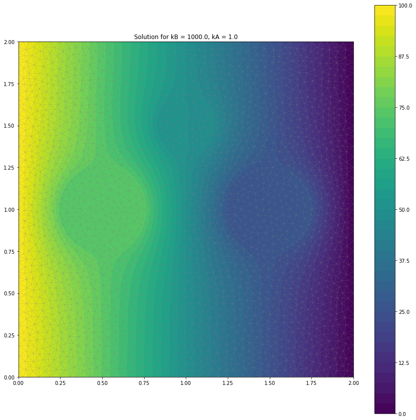
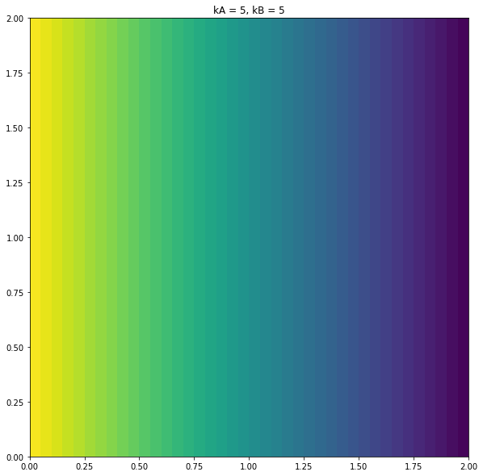
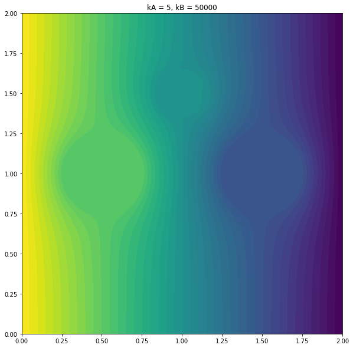

## Éricles Lima, Finite Elements Methods

## Importing libraries


```python
from dolfin import *
from mshr import *
import numpy
from datetime import datetime
import csv
import os
import sys
import matplotlib.pyplot as plt
import numpy as np
```

### User defined parameters:
#### Set the following parameters according to your problem


```python
space_dim = 2
nballs = 3

Lx = 2.0
Ly = 2.0

# Balls' initial positions
centers = [[0.5,1], [1,1.5], [1.5,1]]
radii   = [0.25, 0.15, 0.25]

xc = [[centers[ib][i] for i in range(space_dim)] for ib in range(nballs)]
print(xc)

#xc = [[] for ib in range(nballs)]
#for ib in range(nballs):
#    [xc[ib].append(centers[ib][j]) for j in range(space_dim)]
```

    [[0.5, 1], [1, 1.5], [1.5, 1]]


### Variational problem: Preliminaries
#### Finite elements


```python
order = 1
Pk = FiniteElement("Lagrange", 'triangle', order)

# Dirichlet boundary conditions
# Subdomains
class left(SubDomain):
   def inside(self, x, on_boundary):
       return on_boundary and abs(x[0]-0.0) < DOLFIN_EPS

class right(SubDomain):
    def inside(self, x, on_boundary):
        return on_boundary and abs(x[0]-Lx) < DOLFIN_EPS

class top(SubDomain):
    def inside(self, x, on_boundary):
        return on_boundary and abs(x[1]-0.0) < DOLFIN_EPS

class bottom(SubDomain):
    def inside(self, x, on_boundary):
        return on_boundary and abs(x[1]-Ly) < DOLFIN_EPS

class ball(SubDomain):
   def __init__(self,xc,yc,R):
      self.xc = xc
      self.yc = yc
      self.R = R
      SubDomain.__init__(self) # Call base class constructor!
   def inside (self, x, on_boundary ):
      r = sqrt ( ( x[0] - self.xc ) ** 2 + ( x[1] - self.yc ) ** 2 )
      return ( on_boundary and ( r < self.R * 1.1 ) )

left   = left()
right  = right()
top    = top()
bottom = bottom()
```

#### IO setup


```python
# Choose one IO format
#fileio = 'xdmf'
fileio = 'pvd'
dir_ = './results'

if not os.path.exists(dir_):
    os.mkdir(dir_)

if fileio == 'xdmf':
    filex = XDMFFile(dir_+'/sol.xdmf')
    filex.parameters['functions_share_mesh'] = True
    filex.parameters['rewrite_function_mesh'] = True
    filex.parameters["flush_output"] = True
elif fileio == 'pvd': 
    ufile_pvd  = File(dir_+"/temperature.pvd")
    domfile_pvd = File(dir_+"/auxfunc.pvd")

startTime = datetime.now()
#print('\n   ::> Begin computations')
```

### Mesh generation


```python
if(space_dim == 2):
   domain = Rectangle(Point(0.0,0.0), Point(Lx,Ly))
   for ib in range(nballs):
      inc = Circle(Point(xc[ib][0],xc[ib][1]),radii[ib])
      domain.set_subdomain(ib+1, inc)
else:
   sys.exit("space_dim.eq.3 not implemented")

mesh = generate_mesh ( domain, 40 )
print("    |-Mesh done")
print("    |--Number of vertices = "+str(mesh.num_vertices()))
print("    |--Number of cells = "+str(mesh.num_cells()))
print("    |--Cell size hmax,hmin = %.3g %.3g" % (mesh.hmax(), mesh.hmin()))
```

        |-Mesh done
        |--Number of vertices = 2538
        |--Number of cells = 4906
        |--Cell size hmax,hmin = 0.0636 0.032


#### This should be the same as len(Function(W).vector())


```python
# Finite element space
W = FunctionSpace(mesh, Pk)
print("    |--Total number of unknowns = %d" % (W.dim()))
```

        |--Total number of unknowns = 2538


#### Dirichlet boundary conditions on W


```python
# Fixed boundary temperature: left and right
Tleft   = Constant(100)
Tright  = Constant(0)

bcs = []
bcleft  = DirichletBC(W, Tleft, left)
bcs.append(bcleft)
bcright = DirichletBC(W, Tright, right)
bcs.append(bcright)
```

### Variational formulation: Poisson problem


```python
u = TrialFunction(W)
v = TestFunction(W)

# Add the different inclusions to the domain of integration
funcdom = MeshFunction("size_t", mesh, mesh.topology().dim(), mesh.domains())
dx = Measure("dx")(subdomain_data=funcdom)


dxA = dx(0)
dxB = dx(1)
for ib in range(nballs-1):
   dxB = dxB + dx(ib+2)


# Volumetric source
fA = Constant(0)
fB = Constant(0)

# Bilinear and linear forms
# Thermal conductivity
kA,kB = 1.0, 1000.0
condA, condB = Constant(kA), Constant(kB)

a = inner(condA*grad(u), grad(v))*dxA + inner(condB*grad(u), grad(v))*dxB
L = fA*v*dxA + fB*v*dxB
```

### Solution


```python
w = Function(W)
solve(a == L, w, bcs)

# IO
#w.rename("T","T")
if fileio == 'xdmf':
  filex.write(w, 0)
  filex.write(funcdom, 0)
elif fileio == 'pvd':
  ufile_pvd << w
  domfile_pvd << funcdom

elapsed_time = datetime.now() - startTime
print('\n  ::> Elapsed time: ', str(elapsed_time), '\n')

if fileio == 'xdmf':
    filex.close()
```

    
      ::> Elapsed time:  0:00:02.113934 
    


```python
kA,kB = 1.0, 1000.0
condA, condB = Constant(kA), Constant(kB)

a = inner(condA*grad(u), grad(v))*dxA + inner(condB*grad(u), grad(v))*dxB
L = fA*v*dxA + fB*v*dxB

w = Function(W)
solve(a == L, w, bcs)
```


```python
plt.figure(figsize=(15,15))
#plot(mesh,linewidth=.2)
c = plot(w, wireframe=True, title=f'Solution for kB = {kB}, kA = {kA}')
plt.colorbar(c)
```


    <matplotlib.colorbar.Colorbar at 0x7f25891f6438>





#### Compute errors


```python
ue = Expression('Tleft -( Tleft - Tright ) * x [0]/ Lx', 
                degree = 1, Tleft = 100, Tright=0, Lx = 2)
gradue = Expression((' -( Tleft - Tright ) / Lx' , '0'), 
                    degree = 0, Tleft = 100, Tright=0, Lx = 2)

w = Function(W)
solve ( a == L , w ,bcs )
#plt.plot(mesh)

errorL2 = assemble (( w - ue ) **2* dx)
errorH1 = errorL2 + assemble (( grad ( w ) - gradue)**2*dx)
print ( "| - Errors = " , sqrt(errorL2), sqrt ( errorH1 ))
```

    | - Errors =  6.583257141302193 54.25447359053499


### Try solving for different values of $\kappa_b$ 


```python
dx = Measure ("dx")(subdomain_data = funcdom)
dxA = dx (0)
dxB = dx (1)
    
for ib in range(nballs -1):
    dxB = dxB + dx(ib +2)

    
kA,kB = 5, 5.0
condA, condB = Constant(kA), Constant(kB)
    
#, 0.25 ,0.5 ,1 ,4 ,8 ,16 ,32 ,64 ,128 ,512 ,1024    
for i,kB in enumerate([5, 50000]):
    condB = Constant(kB)

    # Bilinear and linear forms
    a = inner(condA * grad(u) , grad(v))*dxA + inner(condB * grad(u) , grad(v)) * dxB
    L = fA * v * dxA + fB * v * dxB

    # Solution
    w = Function(W)
    solve (a == L, w, bcs)
    
    
    # IO
    ufile_pvd   = File(dir_+f"/temperature{i}.pvd")
    domfile_pvd = File(dir_+f"/auxfunc{i}.pvd")
    
    w.rename("T","T")
    ufile_pvd << w
    domfile_pvd << funcdom
    
    plt.figure(i)
    plt.figure(figsize=(10,10))
    plt.title(f"kA = {kA}, kB = {kB}")
    plot(w)
```


    <Figure size 432x288 with 0 Axes>








### Compute the amount of heat entering or leaving the domain through the left or the right boundaries
$Q_{in} = \int_{\partial V_{left}} \kappa_A \nabla u_h \cdot \check{e}_1 ds$, $Q_{out} = \int_{\partial V_{right}} -\kappa_A \nabla u_h \cdot \check{e}_1 ds$


```python
boundaries = MeshFunction("size_t", mesh, mesh.topology().dim() - 1)
boundaries.set_all(0)

left.mark(boundaries, 1)
right.mark(boundaries, 3)
#top.mark(boundaries, 4)
#bottom.mark(boundaries, 5)

ds = Measure("ds")(subdomain_data = boundaries)
n = FacetNormal(mesh)

# Qin = assemble(kA*grad(w)*n*ds)
Qin = assemble(kA * inner(grad(w), n) * ds(1))
Qout = assemble(kA * inner(grad(w), n) * ds(3))
#Qtop = assemble(kA * inner(grad(w), n) * ds(4))
#Qbot = assemble(kA * inner(grad(w), n) * ds(5))
Qtot = assemble(kA * inner(grad(w), n) * ds)

print("Heat entering: {:.8f} \nHeat leaving: {:.8f}".format(Qin, Qout))
#print("Heat top: {:.8f} \nHeat bottom {:.8f}".format(Qtop, Qbot))
print(Qtot)
```

    Heat entering: 646.01089376 
    Heat leaving: -645.46894056
    0.3800802178533047


### Compute effective thermal diffusivity: 
$\kappa_{eff} = \frac{|Q|}{|u_l - u_r|/L_x}$


```python
def keff(q, ul = 100, ur = 0, Lx = 2, Ly = 2):
    return np.abs(q)/(np.abs(ul - ur)/Lx)/Ly

print(keff(Qin))
```

    6.460108937598318


###  Consider kB >> kA , such that the temperature on each circular region is nearly uniform
Implement the computation of the average temperature on each inclusion, ie

$\bar{T}_i = \frac{1}{|\omega_i|}\int_{\omega_i} u(x)dx$, where $|\omega_i|$ denotes the area of $\omega_i$


```python
#faux = Function(W)
faux = interpolate(Constant(1.0), W)

avgT = []

for ib in range(1,nballs+1):
    area = assemble(faux * dx(ib))
    avgT.append(assemble(w * dx(ib))/area) 

print("kB =",kB,"\nkA =", kA, "\nAverage temp. per circle: ",avgT) 
```

    kB = 50000 
    kA = 5 
    Average temp. per circle:  [74.16315437815996, 50.001450041078655, 25.839661239993255]


```python

```
