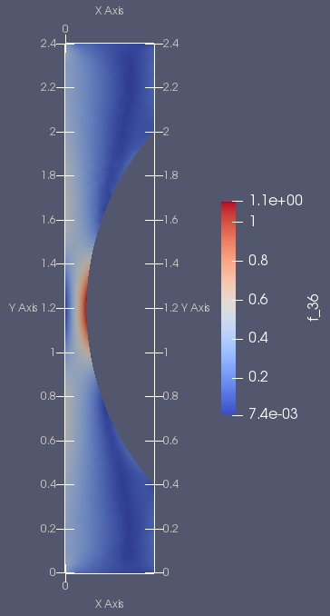
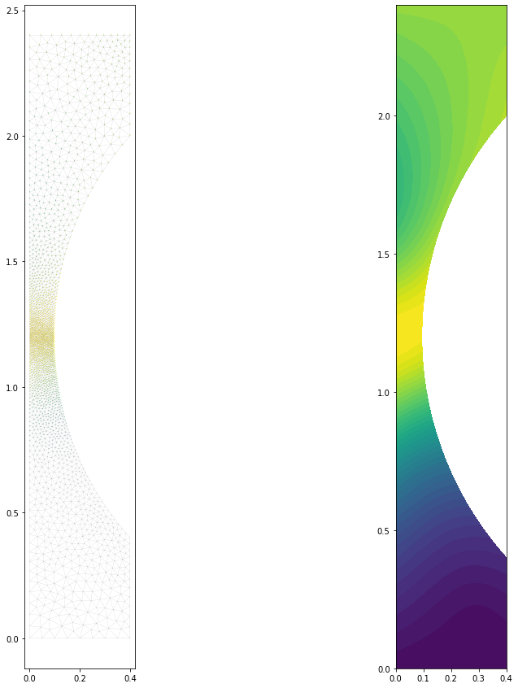
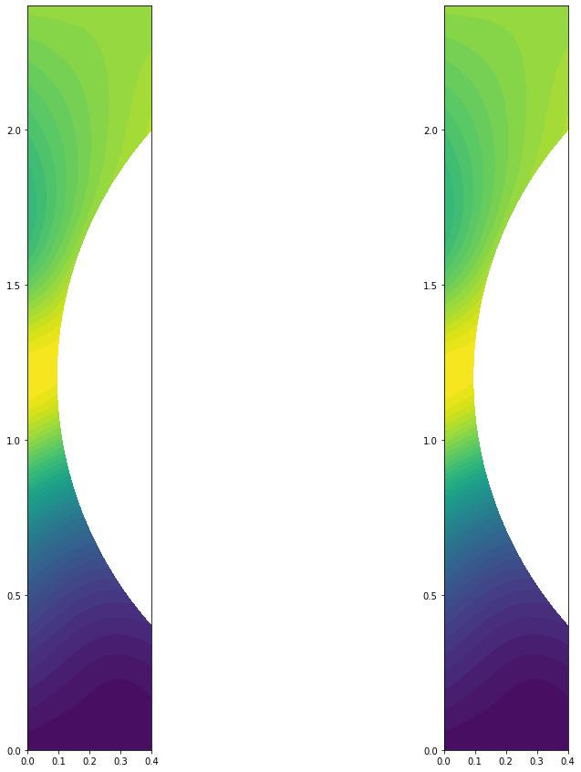
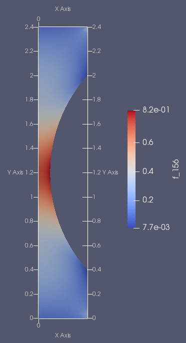
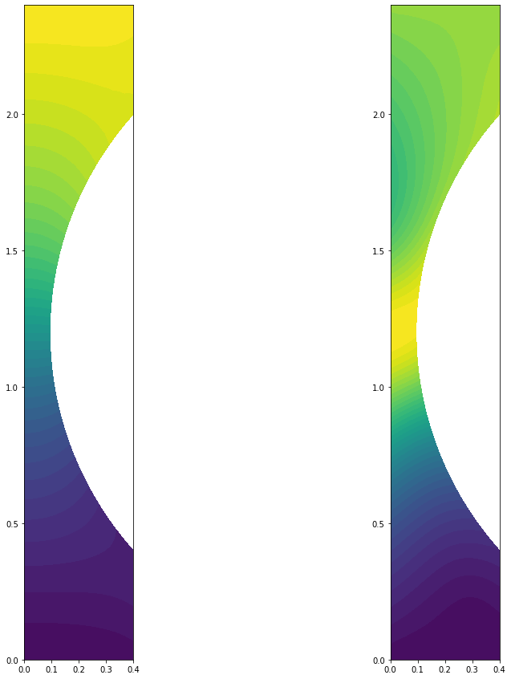
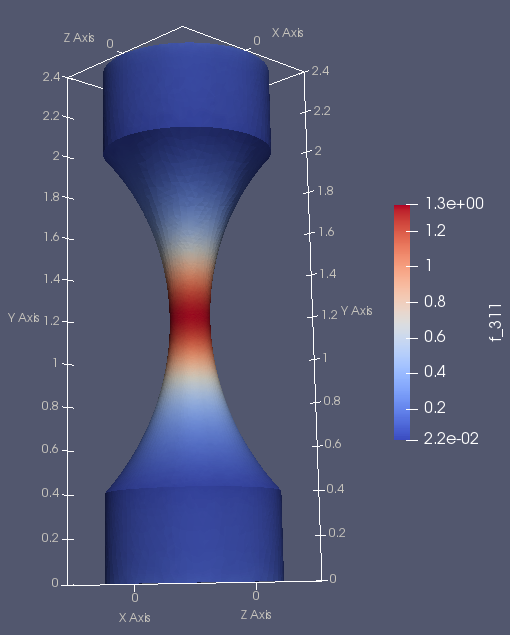
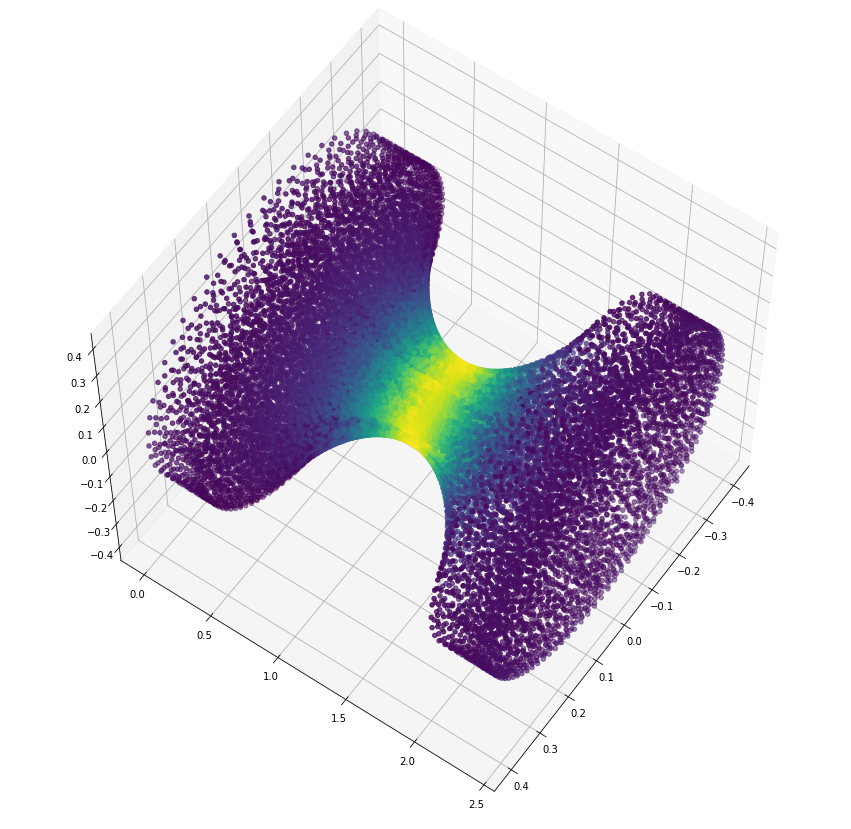
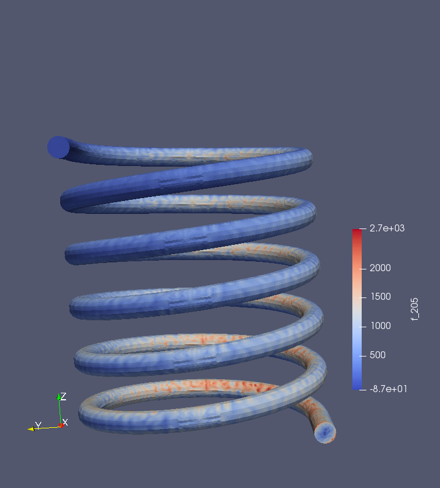
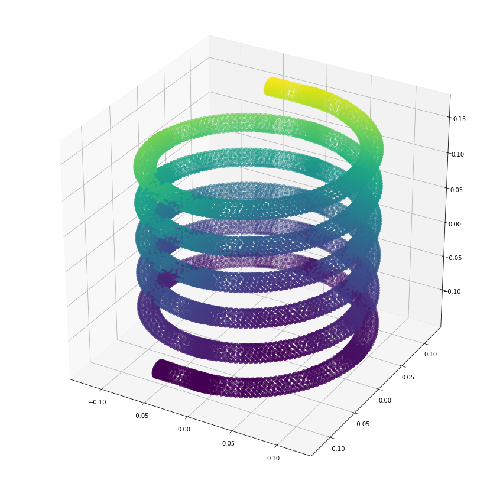

# Solving linear elasticity problems with fenics

## The problem (Geometry)

Consider the following computional domain $\Omega \in \mathbb{R}^2$:


## The problem (Governing equations and boundary conditions)

The elastostatic problem reads as follows:

$$
\begin{cases}
\sigma & = \lambda div(u)I + \mu(\nabla u + (\nabla u)^T) \\
\mu & = \frac{E}{2(1 + \nu)}\\
\lambda & = \frac{E\nu}{(1+\nu)(1-2\nu)} \\
-div(\sigma) & = f   & in\ \Omega \\
u & = u_{bottom} & in\; \Gamma_{bot} = \{(x_0,x_1)\in \partial \Omega, x_1 = 0\} \\
u & = u_{top} & in\ \Gamma_{top} = \{(x_0,x_1) \in \partial \Omega, x_1 = H\} \\
\sigma \cdot n & = F & in\ \Gamma_N = \partial \Omega - (\Gamma_{bottom} \cup \Gamma_{top})
\end{cases}
$$

Where the values are:

* $E = 10$ (Young modulus), $\nu = 0.3$ (Poisson ratio);
* $f = (0\ 0)^T$;
* $F = (0\ 0)^T$;
* $u_{bottom} = (0\ 0)^T$;
* $u_{top} = (0\ 0.1)^T$


# 1) Continuous Variational Formulation

* *Enunciation:*

Find u $\in$ $V_{Dg}$ such that:

$$
a(u,v) = \int_{\Omega}f\cdot v d\Omega + \int_{\Gamma_N}F\cdot v d\Gamma =: l(v)
$$

for all v $\in$ $V_{D0}$, where:

$$
a(u,v) = \int_{\Omega}\sigma(u):\epsilon(v)d\Omega = \int_{\Omega}[\lambda (\nabla\cdot u)(\nabla\cdot v)+2\mu\epsilon(u):\epsilon(v)]d\Omega
$$

* *Details:*

$$
V_{Dg} = \{v \in [H^1(\Omega)]^n; v=g \text{ on } \Gamma_{D}\}
$$

# 2) Discrete Variational Formulation

* *Enunciation:*

Find $u_h \in P_{Dg}$ such that:

$$
a(u_h,v) = \int_{\Omega_h}f\cdot v d\Omega_h + \int_{\Gamma_N}F\cdot v d\Gamma =: L(v)
$$

for all v $\in$ $P_{D0}$, where:

$$
a(u_h,v) = \int_{\Omega_h}\sigma(u_h):\epsilon(v)d\Omega_h = \int_{\Omega_h}[\lambda (\nabla\cdot u_h)(\nabla\cdot v)+2\mu\epsilon(u_h):\epsilon(v)]d\Omega_h
$$

* *Details:*

$$
\begin{split}
& P_k(\Omega_h) = P_k \cap H^1(\Omega_h) \\
& P_k(\Omega) = {v \in H^1(\Omega)\ v \in P_k, \forall k \in \delta_h} \\
& P_{Dg} = \{v \in [P_k(\Omega_h)]^n; v=g \text{ on } \Gamma_{D}\}, P_k(\Omega) \in H^1(\Omega_h)
\end{split}
$$

<!-- * *Details:*

$$
n = \text{dimensão do problema}
$$
$$
P_k = \text{polinômios de grau máximo k aplicada aos graus de liberdade do domínio (2D,3D)}
$$
$$
P_k(\Omega_h) = P_k \cap H^1(\Omega_h)
$$
$$
P_k(\Omega) = {v \in H^1(\Omega)\ v \in P_k, \forall k \in \delta_h}
$$
$$
P_{Dg} = \{v \in [P_k(\Omega_h)]^n; v=g \text{ on } \Gamma_{D}\}, P_k(\Omega) \in H^1(\Omega_h)
$$ -->

# 3) Fenics Script


```python
# Import libraries

from fenics import *
from mshr import *
from datetime import datetime
import csv
import os
import sys
import matplotlib.pyplot as plt
import numpy as np
import seaborn as sns
import pandas as pd

plt.rcParams['figure.figsize'] = [15, 15]
```

### An overview of the code used

The keywords such as _grad_, _div_ and the such are also keywords in the fenics environment

```py
# Define mesh and function space
# mesh = Mesh("neck_2Dcorpo.xml") or Mesh("neck_3Dcorpo.xml")
# We use VectorFunctionSpace, as opposed to FunctionSpace, as the unknown is a vector field
W = VectorFunctionSpace(mesh, "Lagrange", order, space_dim)
u = TrialFunction(W)
v = TestFunction(W)
    
#...  
### Mark the boundaries (ds): "0" stands for the Neumann boundary
### Define boundarie conditions: grouped in the list bcs
### Define functions that are not keywords
# ...

def epsilon(u):
  return 0.5*(grad(u) + grad(u).T)
  #return sym(grad(u)) <- does the same and the line above

d = u.geometric_dimension()
def sigma(u):
  return lbda*div(u)*Identity(d) + 2*mu*epsilon(u)


### Defines the bilinear form a and the linear form L
### Makes use of previously defined constants, such as lbda and mu   
a = (lbda*div(u)*div(v)+2*mu*inner(epsilon(u), epsilon(v)))*dx
# a = inner(sigma(u), epsilon(v))*dx
L = dot(f,v)*dx + dot(F,v)*ds(0)

### Solve the problem
w = Function(W)
solve(a == L, w, bcs, solver_parameters={'linear_solver':'mumps'})
```

### Then we calculate the von Mises tension:

Given the _deviatoric stresses_:
$$
s = \sigma - \frac{tr(\sigma)I}{d}
$$

Where _d_ stands for the linear dimension of the problem, tipically 2 or 3. The von Mises stress (or tension) is defined as:

$$
\sigma_V = \sqrt{\frac32 s:s}
$$

That is calculated thusly:

```py
s = sigma(w) - (1./d)*tr(sigma(w))*Identity(d)  # <- deviatoric stress
von_Mises = sqrt(3./2*inner(s, s))
  
# We're using 'DG' with order 0, that is a function space constant for each cell
V = FunctionSpace(mesh, 'DG', 0)
von_Mises = project(von_Mises, V)
```


```python
# Define the elasticity function

def elasticity(H = 2.4,
               order = 1,
               young_modulus = 10,
               poisson_ratio = 0.3,
               f = Constant((0,0)),
               F = Constant((0,0)),
               u_bottom = Constant((0,0)),
               u_top = Constant((0,0.1)),
               dir_ = './results_',
               case = 1,
               space_dim = 2):
  """ 
  Solves linear elasticity problem
  3) Case == 1 uses condition on top border to be utop = (0, 0.1) and bottom border to be u_bottom = (0,0)
  5) Case == 2 uses condition on top border to be utop = (x, 0.1) 
              where x is a number  
  6) Case == 3 uses u1 = 0 on Γleft = {(x1 , x2 ) ∈ ∂Ω, x1 = 0}
  8) Case == 4 symmetry of revolution
  """
  # Diretório geral
  dir_ = dir_+'case_'+str(case)

  if not os.path.exists(dir_):
        os.mkdir(dir_)
  ufile_pvd   = File(dir_+f'/deformation{space_dim}.pvd')
  vmfile_pvd  = File(dir_+f'/vonmisesd{space_dim}.pvd')

  # Mesh
  if space_dim == 2:  
    mesh = Mesh("neck_2Dcorpo.xml")
  elif space_dim == 3:
    mesh = Mesh("neck_3Dcorpo.xml")
        
  # Function Spaces
  W = VectorFunctionSpace(mesh, "Lagrange", order, from )
  #creio que esse space_dim especifica a dimensão dos vetores
  u = TrialFunction(W)
  v = TestFunction(W)

  class top(SubDomain):
    def inside(self, x, on_boundary):
        return on_boundary and near(x[1], H)
  class bottom(SubDomain):
    def inside(self, x, on_boundary):
        return on_boundary and near(x[1], 0.0)
  class left(SubDomain):
    def inside(self, x, on_boundary):
        return on_boundary and near(x[0], 0.0)
    
  Top = top()
  Bottom = bottom()
  Left = left()  

  boundaries = MeshFunction("size_t", mesh, mesh.topology().dim()-1)
  boundaries.set_all (0)
  Top.mark( boundaries , 1)
  Bottom.mark( boundaries , 2)
  if (case == 3 or case == 4):
    Left.mark(boundaries, 3)
  ds = Measure("ds")( subdomain_data = boundaries )
  n = FacetNormal( mesh )

  # Variaveis auxiliares
  lbda = (young_modulus * poisson_ratio)/((1+poisson_ratio)*(1-2*poisson_ratio))
  mu = young_modulus/(2*(1+poisson_ratio))
  epsilon_u = 2*sym(grad(u))
  epsilon_v = 2*sym(grad(v))

  bcs = []
  bcbottom  = DirichletBC(W, u_bottom, Bottom)
  bcs.append(bcbottom)
  if (case == 1):
    bctop = DirichletBC(W, u_top, Top); bcs.append(bctop)
  elif (case ==2):
    bctop = DirichletBC(W.sub(1), Constant(0.1), Top); bcs.append(bctop)
  elif (case == 3 or case == 4):
    bctop = DirichletBC(W, u_top, Top); bcs.append(bctop)
    bcleft = DirichletBC(W.sub(0), Constant(0.0), Left); bcs.append(bcleft)  

  def epsilon(u):
    return 0.5*(grad(u) + grad(u).T)
    #return sym(grad(u))

  d = u.geometric_dimension()
  def sigma(u):
    return lbda*div(u)*Identity(d) + 2*mu*epsilon(u)
    
  # a = inner(sigma(u), epsilon(v))*dx
  # L = dot(f, v)*dx + dot(F, v)*ds(1)
  if (case != 4):
    a = (lbda*div(u)*div(v)+2*mu*inner(epsilon(u), epsilon(v)))*dx
    if (case == 1):
      L = dot(f,v)*dx + dot(F,v)*ds(0)
    elif (case == 2):
      L = dot(f,v)*dx + dot(F,v)*ds(0) + dot(F,v)*ds(1)
    elif (case == 3):
      L = dot(f,v)*dx + dot(F,v)*ds(0)
  elif (case == 4):
    x = SpatialCoordinate(mesh)
    a = 2*np.pi*(lbda*(div(u)+u[0]/x[0])*(div(v)+v[0]/x[0]) 
                   +2*mu*(inner(epsilon(u), epsilon(v))+u[0]*v[0]/(x[0])**2)*x[0])*dx
    L = 2*np.pi*(dot(f,v)*x[0]*dx + dot(F,v)*x[0]*ds(0))
    
  w = Function(W)
  
  solve(a == L, w, bcs, solver_parameters={'linear_solver':'mumps'})
  #solve(a == L, w, bcs)

  ufile_pvd << w

    
  # Gets stress
  s = sigma(w) - (1./d)*tr(sigma(w))*Identity(d)  # deviatoric stress
  von_Mises = sqrt(3./2*inner(s, s))
  V = FunctionSpace(mesh, 'P', 1)
  von_Mises = project(von_Mises, V)

  vmfile_pvd << von_Mises

  # Compute magnitude of displacement
  w_magnitude = sqrt(dot(w, w))
  w_magnitude = project(w_magnitude, V)
    
  return w, mesh, w_magnitude, von_Mises
```

## Results

### Deformation (comparation between the original form and the derformed one)


### Deformation (displacement vectors)


### Von Mises stress




```python
w1, mesh, w_magnitude1, von_Mises = elasticity()
plt.subplot(1,2,1)
plot(mesh, linewidth=.1)
plot(w1)
plt.subplot(1,2,2)
plot(w_magnitude1)
```


    <matplotlib.tri.tricontour.TriContourSet at 0x7f8269844400>





```python
plot(von_Mises,  title='Stress intensity')
```


    <matplotlib.tri.tricontour.TriContourSet at 0x7f826331f860>


# 5) Now, with new boundary conditions ($u_{0}$ is free on the top)

The same as above, except that now we make no restrictions on the horizontal component at $\Gamma_{top}$, but only on the vertical component ($u_1 = 0.1$).

This is easily effected on code, with the following line

```py
bc = DirichletBC (W.sub(1), Constant(0.1), top)
```

instead of (used to yield the previous results)

```py
bct = DirichletBC (W, Constant((0,0.1)), top)
```

(where "top" stands for a _python_ object that defines the "top" border)

The results are fairly similar to the previous ones, but we show them here for the sake of completeness:

### Deformation (comparison between the original form and the derformed one), followed by the displacement vectors and the von Mises stress chart


<table> 
    <tr> 
        <td>  </td>
        <td>  </td>
        <td>  </td>
    </tr> 
</table>


```python
w2, mesh, w_magnitude2, von_Mises2 = elasticity(case = 2)
plt.subplot(1,2,1)
plot(w_magnitude1)
plt.subplot(1,2,2)
plot(w_magnitude2)
```


    <matplotlib.tri.tricontour.TriContourSet at 0x7f82637b4ba8>





# 6) Additional dirichlet boundary

We can include the additional Dirichlet boundary condition $u_1 = 0$ on $\Gamma_{left} = \{(x0 , x1 ) \in \partial \Omega , x_0 = 0\}$ and solve.

### Deformation (comparison between the original form and the derformed one), and displacement vectors, followed by the von Mises stresses

The constraints are such as to "simmetryse" the geometry in a way, and the results are the expected. See the von Mises stresses.

<table> 
    <tr> 
        <td>  </td>
        <td>  </td>
        <td>  </td>
    </tr> 
</table>

The constraints are such as to "simmetryse" the geometry in a way, and the results are the expected. See the von Mises stresses:

### Von Mises stress


```python
w3, mesh, w_magnitude3, von_Mises = elasticity(case = 3)
plt.subplot(1,2,1)
plot(w_magnitude3)
plt.subplot(1,2,2)
plot(w_magnitude1)
```


    <matplotlib.tri.tricontour.TriContourSet at 0x7f8263434c18>





# 7) 3D Problem

Same as in 2D, but in 3D.

The parameters used are

* $E = 10$ (Young modulus), $\nu = 0.3$ (Poisson ratio);
* $f = (0\ 0\ 0)^T$;
* $F = (0\ 0\ 0)^T$;
* $u_{bottom} =(0\ 0\ 0)^T$;
* $u_{top} = (0\ 0.1\ 0)^T$ 

## The geometry is


### See the deformation


## With vectors, the deformed places are clearer 


### The von Mises stresses




```python
w3d, mesh3d, w_magnitude3d, von_Mises3d =  elasticity(young_modulus = 10,
                                                      poisson_ratio = 0.3,
                                                      f = Constant((0,0,0)),
                                                      F = Constant((0,0,0)),
                                                      u_bottom = Constant((0,0,0)),
                                                      u_top = Constant((0,0.1,0)),
                                                      space_dim = 3)
```


```python
ax = plt.axes(projection='3d')
ax.view_init(60, 35)
#plot(mesh3d)
plot(w_magnitude3d)
```


    <mpl_toolkits.mplot3d.art3d.Path3DCollection at 0x7f82600374a8>


```python
ax = plt.axes(projection='3d')
ax.view_init(60, 35)
plot(von_Mises3d)
```


    <mpl_toolkits.mplot3d.art3d.Path3DCollection at 0x7f825bba04a8>





# 8) 3D Restricted case (symmetry of revolution)

Instead of solving for the whole geometry, we can make use of the problem symmetry and save some calculations - and valuable time.

To do that we make use of the fact that

$$
\begin{cases}
\int_{\Omega_{3D}} 2\mu \epsilon(u):\nabla v d\Omega & = 2 \pi \int_{\Omega_{2D}} 2\mu\left( \epsilon_{2D}(u):\nabla v_{2d} + \frac{u_r v_r}{r^2} \right) r dx_{2D} \\
\int_{\Omega_{3D}} \lambda(\nabla \cdot u):(\nabla \cdot v) d\Omega & = 2 \pi \int_{\Omega_{2D}} \lambda \left(   \nabla \cdot u_{2d} + \frac{u_r}{r}\right)\left( \nabla \cdot v_{2d} + \frac{v_r}{r} \right)r dx_{2D}\\
\end{cases}
$$


The change that has to be done in code is essentially on the definition of the bilinear and linear forms:

```py
    x = SpatialCoordinate(mesh) # <- gets symbolic physical coordinates for the mesh
    a = 2*np.pi*(lbda*(div(u)+u[0]/x[0])*(div(v)+v[0]/x[0]) 
                   +2*mu*(inner(epsilon(u), epsilon(v))+u[0]*v[0]/(x[0])**2)*x[0])*dx
    L = 2*np.pi*(dot(f,v)*x[0]*dx + dot(F,v)*x[0]*ds(0))
```

### See the deformation


### Compare with the actual 3D case (we spliced it to easen vizualization)


It was observed lower stresses in the 3D case over the line

### The magnitude and direction of the deformation (seen on the left)
### Compare with the actual 3D case (we spliced it to easen vizualization, at the right)


<table> 
    <tr> 
        <td>  </td>
        <td>  </td>
    </tr> 
</table>


### Von Mises stress


<table> 
    <tr> 
        <td>  </td>
        <td>  </td>
    </tr> 
</table>


```python
wc, meshc, wmc, vmc = elasticity(case = 4)
```


    ---------------------------------------------------------------------------

    NameError                                 Traceback (most recent call last)

    <ipython-input-1-a608e349ef92> in <module>
    ----> 1 wc, meshc, wmc, vmc = elasticity(case = 4)
    

    NameError: name 'elasticity' is not defined


```python
plot(vmc)
```


    <matplotlib.tri.tricontour.TriContourSet at 0x7f825ba5db70>


# 9) Elastic coil

We can also solve the problem for more complex geometries, such as a coil:


```python
# Define the elasticity function

def elasticityCoil(H = 2.4,
               order = 1,
               young_modulus = 10,
               poisson_ratio = 0.3,
               f = Constant((0,0,0)),
               F = Constant((.0005,.0005,0)),
               fileio = 'pvd',
               dir_ = './results_case_coil'):
  """ 
    Solves elasticity equation for the coil
  """

  if not os.path.exists(dir_):
        os.mkdir(dir_)
  ufile_pvd  = File(dir_+'/deformationCoil.pvd')
  vmfile_pvd  = File(dir_+'/vonmisesCoil.pvd')

  mesh = Mesh("ocoil.xml")   
  facetRegions = MeshFunction("size_t", mesh, "ocoil_facet_region.xml")

  W = VectorFunctionSpace(mesh, 'P', order)
  u = TrialFunction(W)
  v = TestFunction(W)

  ds = Measure("ds")(subdomain_data = facetRegions)
  n = FacetNormal(mesh)    

  bcFixed  = DirichletBC(W, Constant((0,0,0)), facetRegions, 3004)

  # Variaveis auxiliares
  lbda = (young_modulus * poisson_ratio)/((1+poisson_ratio)*(1-2*poisson_ratio))
  mu = young_modulus/(2*(1+poisson_ratio))

  def epsilon(u):
    return 0.5*(grad(u) + grad(u).T)

  d = u.geometric_dimension()
  def sigma(u):
    return lbda*div(u)*Identity(d) + 2*mu*epsilon(u)
     
  a = (lbda*div(u)*div(v)+2*mu*inner(epsilon(u), epsilon(v)))*dx
  L = dot(f,v)*dx + dot(F,v)*ds(3005)

  w = Function(W)
  
  solve(a == L, w, bcFixed, solver_parameters={'linear_solver':'mumps'})
  #solve(a == L, w, bcs)

  ufile_pvd << w

  # Gets stress
  s = sigma(w) - (1./2)*tr(sigma(w))*Identity(d)  # deviatoric stress
  von_Mises = sqrt(3./2*inner(s, s))
  V = FunctionSpace(mesh, 'P', 1)
  von_Mises = project(von_Mises, V)

  vmfile_pvd << von_Mises

  # Compute magnitude of displacement
  w_magnitude = sqrt(dot(w, w))
  w_magnitude = project(w_magnitude, V)


  return w, mesh, von_Mises, w_magnitude
```

### Deformations





```python
wc, meshc, vmc, wmc = elasticityCoil()
```


```python
plot(wmc)
```


    <mpl_toolkits.mplot3d.art3d.Path3DCollection at 0x7f5cb25a8240>





```python

```
